# 轻截 · QuickCapture

轻截是一款 Windows 截图与录屏工具：框选画面后直接标注、复制或保存，录屏结束后裁切和导出，并从最近文件继续查看成果。采用 C# / WPF 与 Windows 原生采集接口，当前版本为 **0.10.0**。

## 主要能力

- **截图与标注**：区域、窗口、整个桌面截图；窗口吸附；箭头、形状、涂鸦、马赛克、文字、可编辑步骤编号；可撤销的二次裁剪与对象编辑。
- **原位文字**：在截图上透明输入中文、英文和多行文字，实时预览字体、字号、颜色、粗细及对齐；完成后可以移动、删除或双击重新编辑。
- **本地 OCR**：当前裁剪范围的简体中文、繁体中文与英文文字提取；可编辑结果、保留 / 合并换行和一键复制；后台识别可取消。
- **贴图对照**：置顶图片、滚轮缩放、Ctrl+滚轮透明度、恢复原尺寸、鼠标穿透及托盘统一隐藏 / 恢复 / 解除穿透。
- **录屏与导出**：区域、窗口、显示器录制；暂停 / 继续，系统声音与麦克风；时间裁切、画面裁剪、变速、静音，导出 MP4 / WebM / GIF。
- **文件与日常操作**：截图支持 PNG / JPG / WebP / BMP，复制、自动保存、置顶贴图；最近文件、保存目录、全局快捷键、托盘和浅色 / 深色主题。

## 本轮录屏编辑与截图属性栏

录屏编辑窗口完整跟随应用的浅色 / 深色主题，已经打开的窗口也会即时更新。次要按钮采用有边框的灰绿色实色背景，确认裁剪与导出使用青绿主色，普通、悬停、按下、选中、键盘焦点与禁用有明确区别。标题栏左侧留空，内容区标题保留，右侧仍可最小化、最大化 / 还原与关闭；原生标题栏和边缘命中区域保留拖动及调整尺寸。

截图第二层仅为带选项的工具或选中对象显示；裁剪、空白选择、复制、保存与取消时完全收起，不留空面板或高度。每个属性栏按实际可见内容决定宽度，文字确认按钮只在输入期间占位；切换工具、开始 / 完成文字都会重新测量，窄屏自动换行并避让屏幕边缘。原位文字控件不会因测量而重建，中文组合保护、对象修改与撤销重做继续沿用。另修复旧版 FFmpeg 在截取后改变帧率时补出尾帧造成的音视频时长差异。

<p align="center">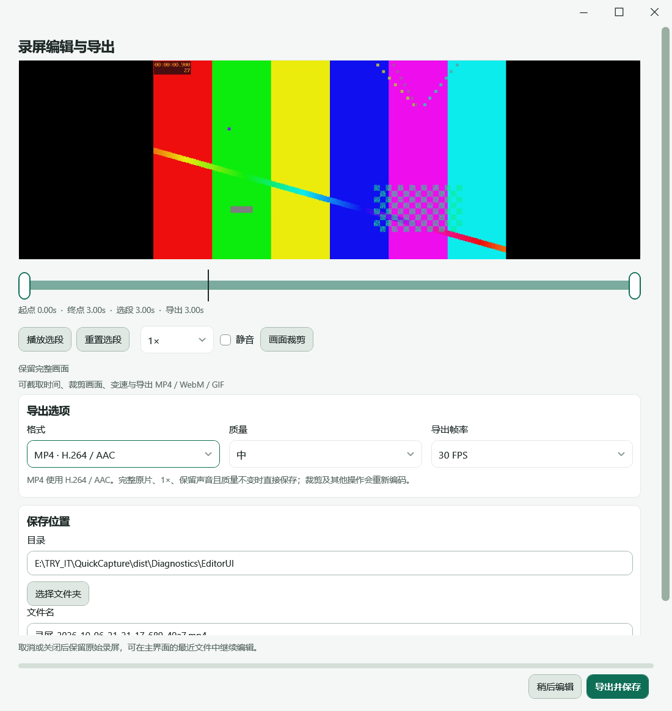 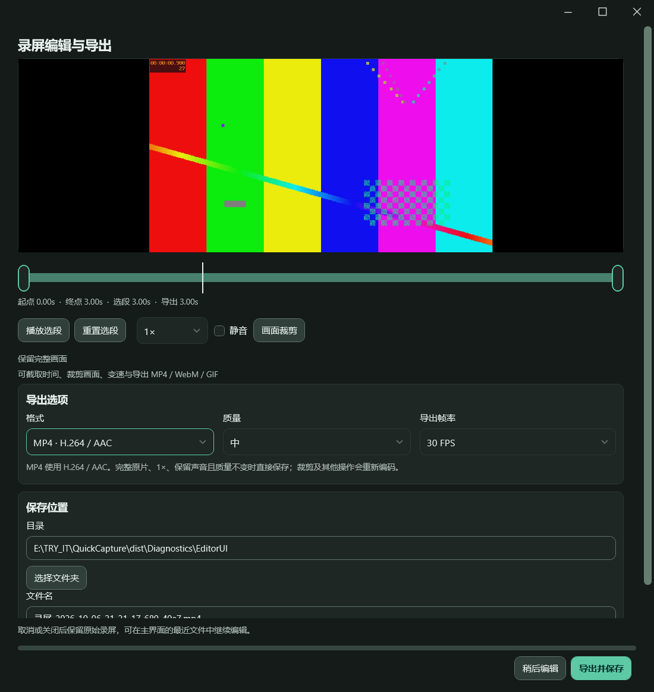</p>

<p align="center">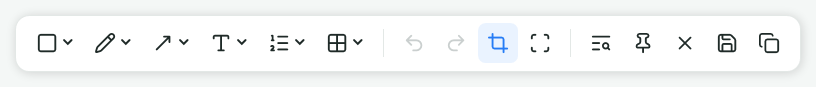<br/>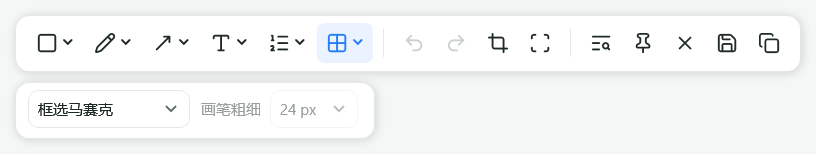</p>

实现与验收边界见 [录屏主题与按需属性栏](docs/recording-editor-and-context-toolbar.md) 和 [验收记录](docs/verification.md)。真实桌面输入在本轮运行环境被前台窗口检查阻止；窗口状态、原生命中区域、主题渲染和导出使用真实 WPF 窗口验证，按钮悬停 / 按下的图件使用 WPF 状态模拟。系统输入法候选窗和混合 DPI 多屏仍需复测。

## 截图工具栏与文件预览

截图采用两层浮动圆角面板，主栏按绘制、编辑和输出分组，属性栏随工具或选中的标注显示设置；常用色块、调色盘和吸管可直接操作。两种主题共用布局，窄窗口自动换行，选区边缘自动避让。最近文件左侧显示真实图片或视频首帧，保留原行高和操作；透明图片显示棋盘格，视频带播放标记。详见 [工具栏与预览说明](docs/toolbar-and-previews.md)。

<p align="center">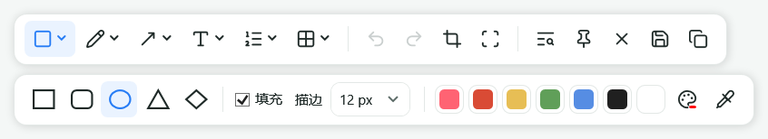<br/>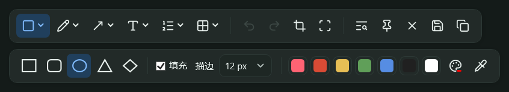</p>

<p align="center">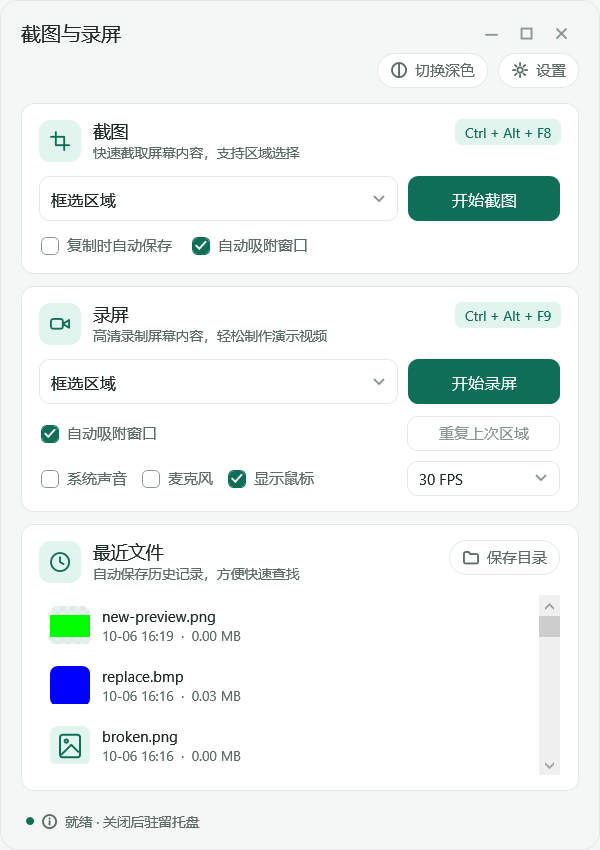 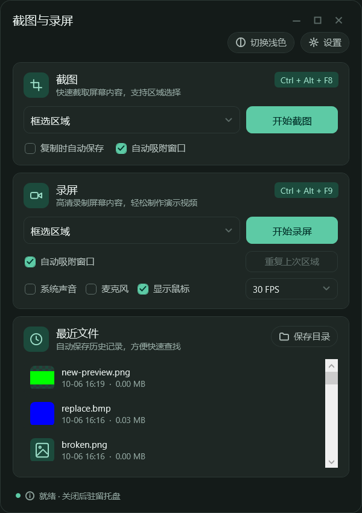</p>

## 办公功能

截图后按 `O` 提取文字，可直接修改并复制；按 `D` 连续添加步骤编号，按 `E` 选中后移动、缩放或删除，双击修改数字。编号面板可设置下一个数字，删除不会重排。贴图按 `P`，滚轮缩放、`Ctrl+滚轮` 调整透明度，右键打开菜单。开启穿透后，从托盘选择 **解除全部贴图穿透并恢复**。

便携包已包含三种语言模型，识别不联网。首次源代码构建需运行 `python tools/setup-ocr.py` 下载固定 SHA-256 模型。详见 [使用说明](docs/office-tools.md)、[OCR 方案对照](docs/ocr-options.md) 和 [后续路线图](docs/roadmap.md)。

<p align="center">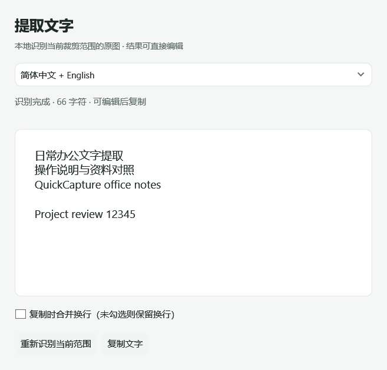 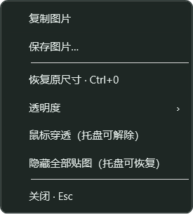</p>

## 界面预览

<p align="center"></p>

截图、录屏、最近文件采用统一的实色卡片和青绿主色。文件行悬停或键盘聚焦后显示更多操作与打开目录，可将文件移到回收站；更多记录仅在列表内部滚动。主面板默认 480×680 DIP，设置窗口打开时与主窗口的当前宽高完全一致，左上角仅显示“设置”。详见 [界面优化说明](docs/panel-optimization.md)。

<p align="center">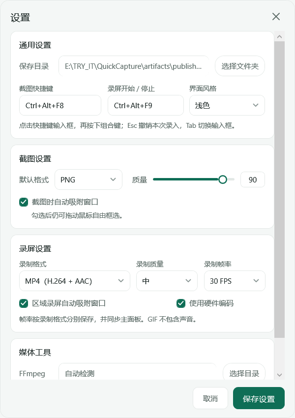 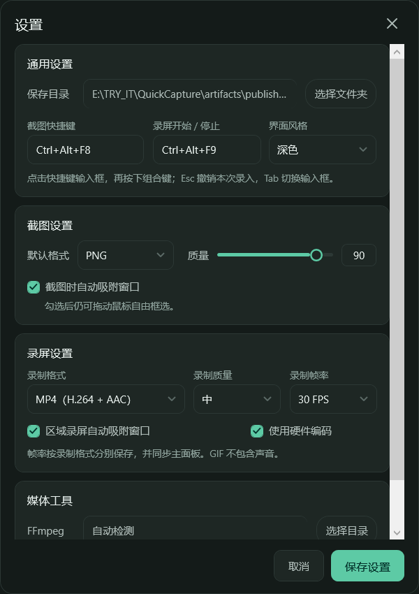</p>

MP4、WebM、GIF 分别记住自己的帧率。设置中切换录制格式会显示对应选项，并即时预览主面板；保存后保留，取消或关闭会恢复。主面板修改帧率也会保存到对应格式。详见 [帧率同步与兼容说明](docs/recording-preferences.md)。

<p align="center"></p>

文字直接显示在截图上，透明编辑框保留下面的画面。字体和颜色设置立即更新效果；细边框及光标只用于编辑，不会出现在保存或复制的图片中。

## 快速开始

1. **截图**：选择模式，点击“开始截图”，或按主界面显示的截图快捷键。框选区域后在浮动工具栏标注；点击复制或保存，也可用 `Ctrl+C` / `Ctrl+S`。
2. **添加文字**：点击文字工具或按 `T`，再点击画布。直接输入中文、英文或多行文字，`Enter` 换行；点击“完成文字”或按 `Ctrl+Enter` 确认，点击“取消文字”或按 `Esc` 取消。文字编辑时可以调整样式、打开调色盘或使用吸管。切换到选择工具 `E` 可移动或删除文字，双击已有文字重新编辑；`Ctrl+Z` / `Ctrl+Y` 撤销 / 重做。
3. **录屏**：选择模式及声音选项，点击“开始录屏”，或按录屏快捷键。控制条可以暂停 / 继续、停止；停止后在编辑器调整时间段，点击“画面裁剪”调整范围，再选择速度、格式和质量导出。
4. **最近文件**：新保存的文件出现在顶部，双击用系统默认程序打开。双击“待导出”录屏可继续编辑，点击“保存目录”打开输出文件夹。关闭主窗口后驻留托盘，双击托盘图标重新显示，右键菜单退出。

新用户默认快捷键为 `Ctrl+Alt+F8` / `Ctrl+Alt+F9`；已有配置保留原组合。首次启动遇到占用时会尝试备用组合，请以主界面实际显示为准。可在“设置”中直接按组合键重新录入。

## 获取与运行

下载 [v0.10.0 Windows x64 便携包](https://github.com/Xhonesty/QuickCapture/releases/download/v0.10.0/QuickCapture-win-x64.zip)，或查看 [Release 更新说明与 SHA-256 校验文件](https://github.com/Xhonesty/QuickCapture/releases/tag/v0.10.0)。源码仓库：[Xhonesty/QuickCapture](https://github.com/Xhonesty/QuickCapture)，默认分支为 `main`。

使用便携包时，解压整个文件夹并运行 `QuickCapture/QuickCapture.exe`。自带 .NET 运行时和 FFmpeg / ffprobe，无需安装 SDK；不能只复制 EXE。程序目录需要可写。

从源码构建需要 Windows x64 与 **.NET 10 SDK**。在 PowerShell 中执行：

```powershell
git clone https://github.com/Xhonesty/QuickCapture.git
cd QuickCapture
python tools/setup-ocr.py
.\tools\setup-media.ps1
.\tools\build.ps1
.\dist\QuickCapture.exe
```

`setup-media.ps1` 下载并校验固定版本 FFmpeg / ffprobe，用于录屏编辑和导出；`build.ps1` 生成包含运行时的 `dist`。没有媒体工具时仍可录制并保存完整原生 MP4。已有下载文件也可以传给 `setup-media.ps1 -ArchivePath '下载文件路径'`。

需要自己制作便携包时，构建后运行：

```powershell
.\tools\package.ps1
```

输出为 `artifacts/QuickCapture-win-x64.zip`。源码、缓存、诊断文件、本地设置和捕获文件不会进入便携包；这些内容也由 `.gitignore` 排除。

## 操作细节

<details>
<summary>截图工具、录屏选项与快捷键</summary>

- 区域截图在原位置编辑；窗口与整个桌面截图使用独立编辑器。浮动工具栏优先位于选区下方，贴近边缘时自动避让。点击“重新框选”重选，清除已有标注前会提示。
- 截图和录屏分别提供“自动吸附窗口”，默认开启：悬停预选窗口，单击确认；按住拖动始终自由框选。截图窗口跨屏时仅采集当前显示器内的部分。
- 窗口模式提供实时缩略图与目标预览，显示标题及应用；单击选择后按 Enter、双击或点击“选择”确认。最小化、关闭或已知受保护窗口显示说明，Esc 取消。
- 裁剪工具 `C`：拖动八个手柄调整大小，拖动内部移动；方向键移动 1 原始像素，`Shift+方向键` 移动 10。裁剪外标注只隐藏，可扩大范围或撤销恢复。
- 工具快捷键：`R` 形状、`E` 选择对象、`A` 箭头、`T` 文字、`D` 步骤编号、`O` 提取文字、`B` 涂鸦、`M` 马赛克、`K` 调色盘、`Z` / `Y` 撤销 / 重做、`P` 贴图、`N` 重新框选、`S` 保存、`V` 复制。正常文字输入时不会触发工具快捷键。
- 文字样式支持 Microsoft YaHei UI、SimSun、Segoe UI、Arial、Consolas；提供 12–144 原始像素的预设字号、粗体及左对齐 / 居中 / 右对齐。编辑框保持透明，样式、调色盘与吸管的修改即时更新预览。
- 选择对象后可移动、缩放、方向键微调、Delete 删除。文字编辑按一次确认记录一个撤销步骤；空白内容确认不创建新对象，取消已有文字的编辑恢复原内容。
- 调色盘含预设、最近颜色、HSV、HEX、透明度以及画布 / 屏幕吸管；吸管单击确认，Esc 或右键取消。涂鸦及马赛克在独立属性栏显示粗细 / 模式选项，单次笔迹可整体撤销。
- 保存窗口可临时选择图片格式与质量，不改变默认设置；复制和自动保存沿用默认截图格式，剪贴板同时提供标准位图。
- 录屏默认为 30 FPS、H.264 / MP4、显示鼠标。MP4 与 WebM 各自提供 15 / 30 / 60 FPS，GIF 提供 5 / 10 / 15 / 20 / 30 FPS，默认 15 FPS；三个格式独立保存，设置与主面板同步。系统声音与麦克风独立勾选，默认均关闭。
- 控制条支持暂停 / 继续，视频和声音同步暂停，暂停期间不增加有效时长；暂停后也可以停止。控制条自动靠近录制目标并避让边缘，也可拖动计时区手动放置。
- 录屏速度支持 0.5× / 1× / 1.5× / 2×；导出编辑器按格式提供帧率与质量，临时调整不改变录制默认值。GIF 没有音轨。取消导出保留原片，“待导出”项目可以继续；退出先完成录制，下次再导出。
- 视频“画面裁剪”支持八个手柄、框内移动、自由 / 原始 / 16:9 / 9:16 / 1:1 比例。确认后预览与导出使用同一原始像素范围；裁剪导出成功后仍保留完整母版和已确认配置，可再次调整。
- 主面板主题按钮立即切换并保存；设置中的界面风格即时预览并同步主面板，保存后持久化，取消或关闭设置时恢复原主题。设置页与主窗口当前尺寸一致，保留四组；内容可内部滚动，保存和取消固定在底部。
- 快捷键录入需至少一个修饰键与一个普通按键，支持字母、数字与功能键。Esc 撤销当前录入，Tab / Shift+Tab 切换输入框；保存时检查重复 / 占用，失败保留原来成功注册的组合。

</details>

本次文字交互及验收边界见 [原位文字与最近文件说明](docs/in-place-text.md)。其他已实现交互见 [功能升级说明](docs/feature-upgrade.md)，格式与依赖见 [媒体工具说明](docs/media-tools.md)。

## 文件位置

- `Captures`：默认截图和视频目录，也可在设置中修改。
- `Data/settings.json`：设置和上次录屏区域，原子替换保存。
- `Data/errors.log`：应用错误。
- `Data/recorder.log`：最近一次录制日志，每次录制重置。
- `Data/Recordings`：录屏母版与恢复元数据；取消 / 失败保留。裁剪导出成功后保留完整母版和已确认裁剪配置，可再次调整；未裁剪的成功导出沿用自动清理。
- `Tools/media`：固定版本 FFmpeg / ffprobe 捆绑备用；检测时优先指定目录与系统 PATH。
- `*.partial.mp4`：正在写入或未成功完成的视频。正常停止并完成编码后转为正式 `.mp4`，未完成文件不会出现在最近列表。异常断电或强制结束可能损坏未完成视频。

移动或分享程序时，请复制整个 `dist` 文件夹；DLL 和运行时文件不可只留 EXE。程序目录需可写。移动文件夹后如保存位置仍指向原目录，可在设置中重新选择。

## 系统要求与当前范围

- 面向 Windows 10 22H2 / Windows 11、x64；使用 Windows.Graphics.Capture 要求 Windows 10 1903 或更新版本。
- 需要 Microsoft Visual C++ 2015–2022 x64 运行库；本机已安装。缺失时从 [Microsoft 官方页面](https://learn.microsoft.com/en-us/cpp/windows/latest-supported-vc-redist) 获取。
- Windows N / KN 版本需要 Media Feature Pack。
- 区域选择限于同一显示器；整个桌面截图可包含所有显示器。物理像素坐标转换支持不同 DPI 及负坐标显示器。
- 窗口录制保持窗口未最小化；录制窗口可移动，输出尺寸在开始时固定。
- H.264 输出使用偶数尺寸；奇数宽高会调整至邻近的较小偶数尺寸。
- 区域录屏使用 Desktop Duplication 裁剪，避免 Windows.Graphics.Capture 围住整块显示器的系统边框。窗口及整屏录制仍可能显示对应目标的系统捕获边框。
- 区域录制边框绘制在选区外；边框和计时条还通过 Windows 排除捕获接口避免入镜，Windows 10 2004 及以上支持该排除行为。
- 麦克风使用 Windows 默认输入设备；需在 Windows 隐私设置中允许桌面应用访问麦克风。音频设备变更或断开后请停止并重新开始录制。
- 当前未提供滚动截图、OCR 翻译 / 表格 / 公式、多段拼接、提取音频、MKV / MOV、云端分享和开机自启。

## 开发与构建

安装 .NET 10 SDK 后，在项目目录运行：

```powershell
python tools/setup-ocr.py
.\tools\setup-media.ps1
.\tools\build.ps1
```

仅在 `.tools/dotnet` 已有 SDK、`.tools/feed` 已缓存所需 NuGet 包时，才使用离线构建：

```powershell
.\tools\build.ps1 -Offline
```

源代码在 `src`，无需 Visual Studio。常用入口：

| 文件 | 职责 |
| --- | --- |
| `MainWindow.xaml` / `.cs` | 主界面、托盘、截图录屏流程 |
| `SelectionWindow.cs` / `ToolbarPlacement.cs` | 各显示器原位选区、工具栏避让与 DPI 坐标转换 |
| `AnnotationSurface.cs` / `ScreenshotEditor.cs` / `EditorWindow.cs` | 共享标注操作、导出、复制、贴图 |
| `InPlaceTextEditor.cs` | 透明文字输入、实时样式、确认 / 取消及中文输入法组合保护 |
| `ScreenshotToolbar.cs` / `ScreenshotToolbarStyles.xaml` | 共享两层面板、图标状态及窄屏换行 |
| `HoverToolOptions.cs` | 自定义调色盘与嵌套下拉窗口 |
| `RecentThumbnail.cs` | 异步缩略图、视频首帧、文件版本与有容量限制的缓存 |
| `ThemeService.cs` / `App.xaml` | 浅色与深色资源、即时主题切换 |
| `WindowSnapper.cs` / `Native.cs` | 窗口层级、可见边界与悬停吸附 |
| `RecordingFrame.cs` | 精确选区录屏边框、鼠标穿透与捕获排除 |
| `Assets/app.png` / `app.ico` | 去白边的透明图标及 16–256 像素多尺寸 ICO；处理提示词见 `docs/icon-processing.md` |
| `CaptureService.cs` / `RecorderService.cs` | 原生采集、实时编码、音频与文件完成 |
| `OcrService.cs` / `OcrWindow.cs` | 本地识别工作进程、取消与可编辑结果 |
| `PinWindow.cs` / `PinMenuStyles.xaml` | 贴图集中管理、缩放透明度、穿透与恢复 |
| `HotkeyService.cs` / `Settings.cs` | 快捷键注册和本地设置 |
| `CropHandles.cs` / `ToolCatalog.cs` / `IconSet.cs` | 二次裁剪、配置驱动图标与工具快捷键 |
| `ImageExportService.cs` / `ScreenshotSaveWindow.cs` | 四种图片格式、质量及剪贴板兼容性 |
| `RecordingEditWindow.cs` / `TrimTimeline.cs` | 录屏预览、时间段与导出交互 |
| `RecordingEditorStyles.xaml` / `RecordingWindowChrome.cs` | 录屏按钮状态、动态主题与简洁窗口标题栏 |
| `RecordingBar.cs` / `VideoCrop.cs` / `VideoCropOverlay.cs` | 暂停控制条、原始像素画面裁剪与比例交互 |
| `WindowPicker.cs` | 实时窗口缩略图、目标选择与预览 |
| `MediaTools.cs` / `VideoExportService.cs` / `RecordingRecovery.cs` | 依赖检测、转换、取消及母版恢复 |
| `DesignTokens.xaml` / `UiDesign.cs` | 统一布局与控件规范，见 [设计规范表](docs/design-spec.md) |

## 集成验证

v0.9.0 工具栏与缩略图专项覆盖两主题、窄窗口、小选区与屏幕边缘、四种图片与视频预览、缓存、刷新滚动、打开删除、待导出继续编辑，以及原位文字 / 裁剪 / 剪贴板回归：

```powershell
.\dist\QuickCapture.exe --self-test --toolbar-only
```

以上保留 v0.9.0 的 20 / 20 历史记录，归档于 `artifacts/toolbar-preview-results.json`。v0.10.0 运行以下新增专项：

```powershell
.\dist\QuickCapture.exe --self-test --editor-ui-only
.\dist\QuickCapture.exe --self-test --context-toolbar-only
```

本轮录屏主题 4/4、截图上下文 6/6 通过，归档于 `artifacts/editor-ui-results.json`、`context-toolbar-results.json`；媒体专项 9/10 通过，真实时间轴拖动被前台保护阻止。两种主题、原生命中区域与窗口控制命令、按需属性宽度、文字组合事件、裁剪确认 / 取消及真实视频导出已检查。完整工具栏原生输入、系统输入法候选窗及外部剪贴板接收仍需可交互桌面复测，详见 [验收记录](docs/verification.md)。

v0.8.0 增加办公功能专项入口，自动验证结果与边界见 [验收记录](docs/verification.md)：

```powershell
.\dist\QuickCapture.exe --self-test --office-only --pointer
```

以下保留 v0.7.0 及既有验证入口。

本次发布验证设置尺寸、标题、帧率同步、取消 / 保存、旧配置迁移、两主题和所有可选帧率的真实导出，并回归媒体编辑与导出流程：

```powershell
.\dist\QuickCapture.exe --self-test --preferences-only
.\dist\QuickCapture.exe --self-test --media-only
```

诊断结果写入 `dist/Diagnostics/results.json`，每次运行会覆盖前次结果；两组结果分别归档到 `artifacts/preferences-results.json` 与 `artifacts/media-v0.7.0-results.json`。使用生成的测试画面和音轨，不采集桌面录屏或麦克风。本次结果和边界见 [验收记录](docs/verification.md)。以下为既有完整验证入口，需要普通交互桌面的截图、录屏及相应音频权限：

```powershell
.\tools\build.ps1 -Offline -Test
# 加测默认麦克风与系统声音混音（会短暂采集麦克风）：
.\tools\build.ps1 -Offline -Test -Microphone
# 仅验证主题和原位截图界面，不采集录屏及音频：
.\dist\QuickCapture.exe --self-test --ui-only
# 单独复现新增截图检查或录屏导出检查：
.\dist\QuickCapture.exe --self-test --upgrade-only
.\dist\QuickCapture.exe --self-test --media-only
```

完整测试会短暂显示动态验证窗口及选区，获取桌面图像并生成约 3 秒的视频；诊断文件保存在 `dist/Diagnostics`，界面预览保存在 `artifacts/screenshots`。仅界面检查使用生成的示例桌面，设置和保存文件也使用诊断目录。测试需要普通交互桌面中的系统采集权限，受限进程可能无法正确访问窗口、鼠标或快捷键。

`Diagnostics/results.json` 为结果，`display.json` 记录测试 DPI。覆盖快捷键冲突回滚、标注与撤销、PNG 原始尺寸和马赛克替换、负坐标、当前 DPI 下选区、原生截图、窗口/区域录屏、奇数尺寸硬件编码与系统声音；界面检查覆盖主题持久化、工具栏边缘位置、原位编辑像素和重新框选，以及图标、曲线涂鸦、笔迹式马赛克、窗口吸附的开关和自由框选。快捷键录入检查使用实际按键，验证 Alt、数字、Esc、Tab、已有组合拦截、保存和取消；仅在验证窗口处于前台时发送测试按键。完整检查还验证实际录屏边框位置、焦点及区域采集像素。最终交付验证结果见发布目录中的 `verification.md`，源项目中位于 `docs/verification.md`。

既有集成检查比较二次裁剪后的整幅像素、各种标注与马赛克锚定、八个手柄实际拖动、1 / 10 px 按键移动、50% 缩放裁剪、四种图片的文件头与质量、实际剪贴板类型、默认值联动，以及带 440 Hz 音轨的视频裁切 / 变速时长与音调、完整解码、GIF 无音轨、取消及缺依赖降级。这些检查的说明不代表本次重新运行了完整录屏测试。
