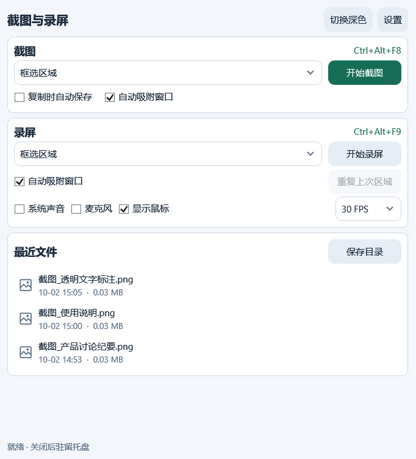
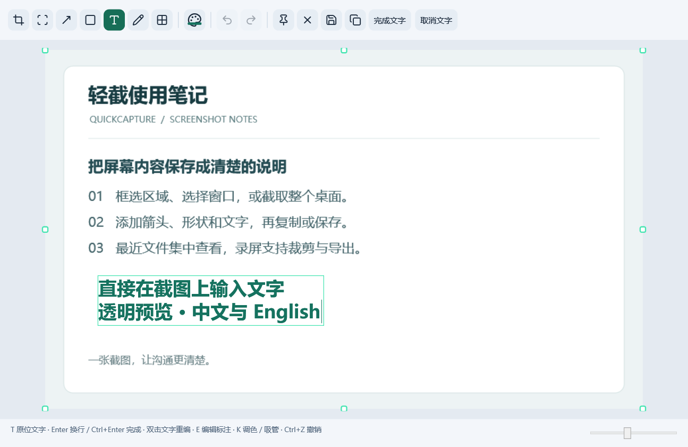

# 原位文字与最近文件

本说明对应最近文件卡片和截图文字交互，验收图件复用同一轮界面检查。

## 最近文件

最近文件与截图、录屏使用相同的圆角卡片、边框和内边距。标题位于卡片左上角，“保存目录”位于同一行右侧；图片与视频使用小图标，名称、生成时间及大小分层显示。长名称省略显示，悬停查看完整名称。

列表使用紧凑高度，较多记录在内部滚动；空列表显示简洁提示。新保存的文件按时间出现在顶部。双击普通文件调用系统默认程序，双击“待导出”录屏继续编辑，保存目录按钮仍打开当前输出文件夹。



默认窗口内可以同时看到截图、录屏、最近文件及底部状态。

## 文字操作

1. 选择文字工具 `T`，点击画布插入位置。透明输入框直接显示在截图上，细边框帮助识别编辑范围。
2. 输入中文、英文或多行文字；`Enter` 换行。编辑范围随内容调整，字体、字号、颜色、粗细及对齐实时预览。可选择 Microsoft YaHei UI、SimSun、Segoe UI、Arial、Consolas，12–144 原始像素的预设字号、粗体及左对齐 / 居中 / 右对齐。
3. 编辑期间可以调整文字样式、打开调色盘及取色。输入法组合输入期间不触发提交、取消或工具快捷键。
4. 点击“完成文字”或按 `Ctrl+Enter` 确认；点击“取消文字”或按 `Esc` 取消。新增文字取消不留下对象，编辑已有文字取消恢复编辑前内容，空白内容确认不创建新对象。
5. 使用选择工具 `E` 移动文字，Delete 删除；双击已有文字重新编辑。`Ctrl+Z` / `Ctrl+Y` 撤销 / 重做，一次确认形成一个历史步骤。



文字采用原图坐标保存，预览跟随画布缩放和滚动；导出只绘制文字对象，编辑框、光标、控制点和占位提示不会进入图片或剪贴板。

## 验收记录

2026-10-02：Release 构建成功，8 项集中检查通过。发现问题后仅复测对应失败项；其余结果保留，没有重跑录屏或音频检查。

| 范围 | 结果 |
| --- | --- |
| 默认窗口的三张卡片、状态与列表内部滚动 | 通过：560×640 DIP、3–5 条完整记录、20 项内部滚动；空状态及临时目录新文件置顶 |
| 原位中文 / 英文 / 多行输入，完成与取消 | 通过：真实编辑器、Enter / Ctrl+Enter / Esc、空白不建对象 |
| 中文输入法组合输入及属性操作 | WPF 组合开始 / 更新 / 完成事件与快捷键隔离通过；字体、粗体、对齐、HEX 和画布吸管操作通过。系统候选窗完整选词流程未实测 |
| 透明预览、保存 / 复制、导出不含编辑装饰 | 通过：字形预览与导出逐像素一致、PNG 直通 BGRA 一致、剪贴板 PNG 原数据与保存一致；兼容 BMP 沿用铺白行为 |
| 双击重编、移动 / 删除、撤销 / 重做 | 通过：真实鼠标双击 / 拖动 / 删除；单次确认、取消恢复、图层顺序与裁剪后无改动确认 |
| 缩放、滚动与本机 DPI 下坐标一致 | 通过：150% 画布缩放、横纵滚动、裁剪偏移、144 DPI 源图、本机显示缩放及近边缘中文输入；混合 DPI 多屏未实机验证 |
| README 相对图片路径与构建命令 | 通过：两张真实界面图片、仓库相对路径、Release 构建；源码与此前升级一并提交，同步状态见仓库提交历史 |

结果原件：`artifacts/interface-results.json`。复现入口：

```powershell
.\dist\QuickCapture.exe --self-test --interface-only
# 只重新执行失败项，保留通过结果：
.\dist\QuickCapture.exe --self-test --interface-only --failed-only
```

本次图件采用实际 WPF 主窗口与编辑器，截图内容是无个人信息的示例笔记。此前录屏暂停、视频裁剪等升级的既有验证记录继续保留在 `docs/verification.md`；本次没有重复采集录屏及声音。

截图原件保存在 `artifacts/screenshots/`，首页使用的两张图片位于 `docs/images/`。构建、缓存与个人捕获文件不进入源码提交。
